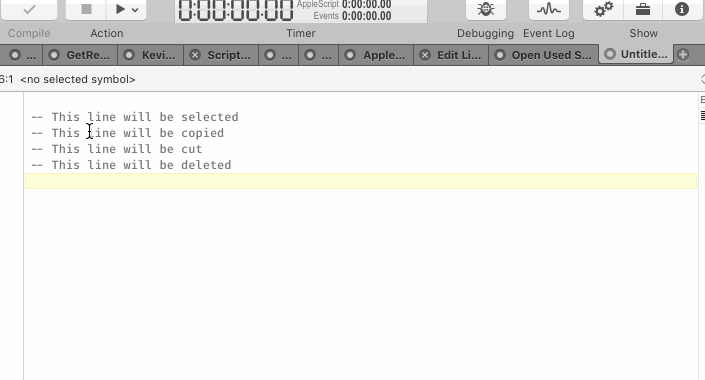
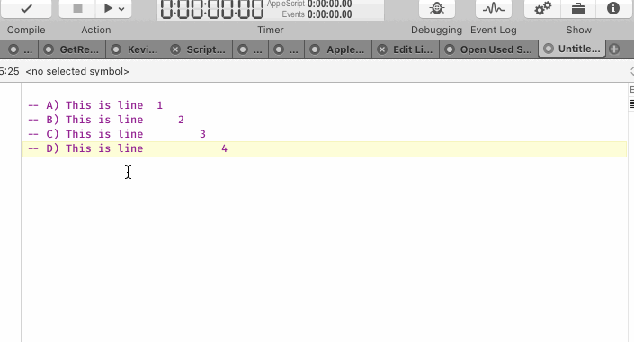
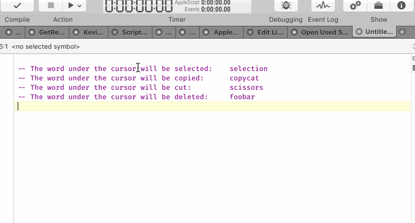
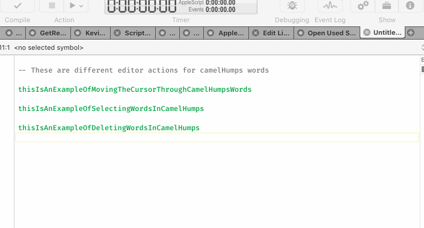
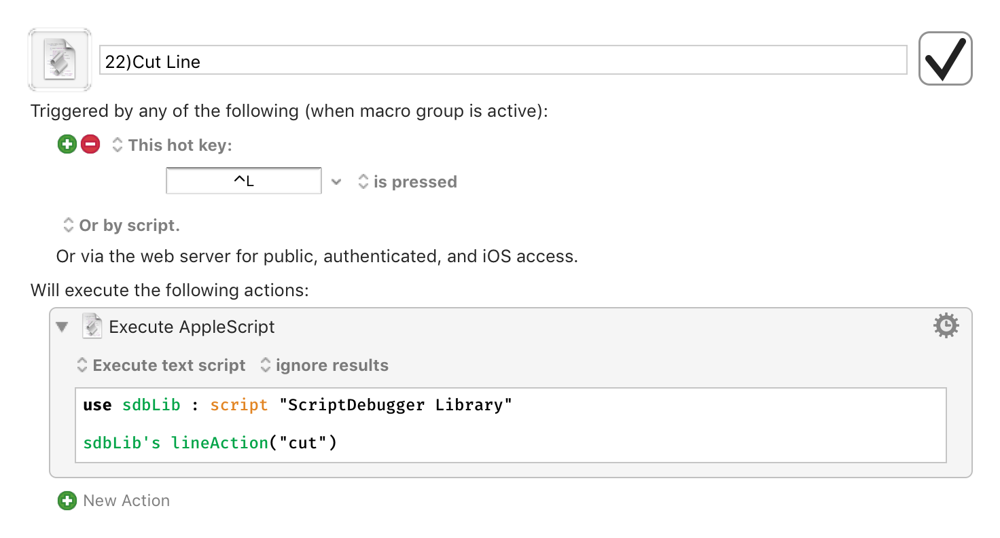

# AppleScript Libraries

Script libraries I've developed over the years others may find useful as well.

- Recall these files must be stored in ``~/Library/Script Libraries``

____
## Kevin's Library
- Collection of handlers useful for everyday scripting, includes text manipulation, file handling, Safari control, list manipulation and others. Shout out to Mark Aldritt (https://github.com/alldritt) for many of his great handlers in here.
____
## Alfred Library
- Handlers for creating new Workflow script objects (mimics classes and constructors from OOP) to be used for developing Alfred 3 workflows. Shout out to Ursan Razvan for developing the original version for use with Alfred 2, I made some adjustments for Alfred 3 and added some extra useful handlers.
____
## Script Debugger Library
- This library provides several useful editor functions for ScriptDebugger.

### Line Actions:
- Select Line
- Copy Line
- Cut Line
- Delete Line

  

- Move Line Up
- Move Line Down

  

### Word Actions:
- Select Word Under Cursor
- Copy Word Under Cursor
- Cut Word Under Cursor
- Delete Word Under Cursor

  

### camelHumps Word Actions
- Move Cursor Through camelHumps words
- Select Words in camelHumps words
- Delete Words in camelHumps words

  

- Personally I use Keyboard Maestro to execute these scripts as in the example below.

  

